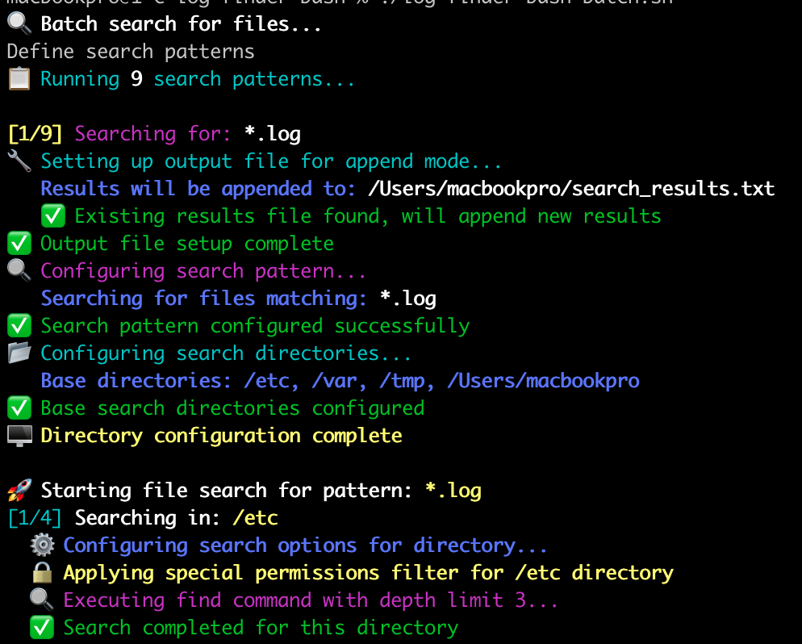
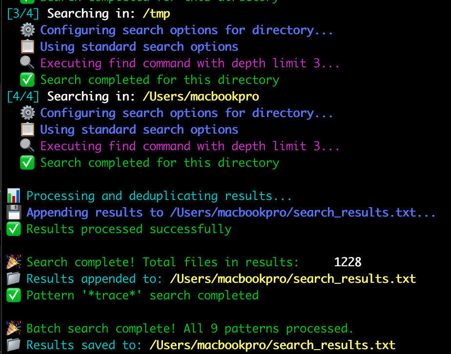

# Log Finder Bash - Fast File Discovery Tool

🔍 **Quickly find and search files and directories across Unix-like systems with colorful, intuitive output**

A powerful command-line tool for developers, system administrators, and DevOps engineers who need to locate log files, configuration files, directories, or any files and folders matching specific patterns across macOS, Linux, and Unix systems.



## Features

✨ **Smart File & Directory Discovery**
- Search both **files and directories** simultaneously
- Search across system directories (`/etc`, `/var`, `/tmp`, `$HOME`)
- Configurable search patterns with glob support
- Intelligent permission handling for protected directories
- Depth-limited searches for optimal performance

🎨 **Beautiful Terminal Output**
- Color-coded progress indicators
- Real-time search status updates
- Clear success/error messaging
- Progress counters for batch operations

⚡ **Batch Processing**
- Run multiple search patterns in sequence
- Automatic result deduplication
- Append mode for cumulative searches
- Predefined patterns for common log file types



## Quick Start

### Single Pattern Search
```bash
# Search for log files and log directories
./log-finder-bash.sh "*.log"
./log-finder-bash.sh "*logs*"
./log-finder-bash.sh "syslog*"

# Search for specific directory names
./log-finder-bash.sh "nginx"
./log-finder-bash.sh "apache*"
./log-finder-bash.sh "*config*"
```

### Batch Search (Multiple Patterns)
```bash
./log-finder-bash-batch.sh
```
Automatically searches for files and directories matching:
- `*.log` - Log files
- `*.log.*` - Rotated log files  
- `*logs*` - Log files and directories
- `syslog*` - System log files and directories
- `*.out` - Output files
- `*.err` - Error files
- `*.error` - Error log files
- `*debug*` - Debug files and directories
- `*trace*` - Trace files and directories

## Installation

```bash
git clone https://github.com/your-username/log-finder-bash.git
cd log-finder-bash
chmod +x *.sh
```

## Use Cases

- **DevOps**: Quickly locate application logs and config directories across servers
- **Debugging**: Find error logs, trace files, and debug directories during troubleshooting
- **System Administration**: Discover configuration files and log directories
- **Security Analysis**: Locate audit logs and security-related directories
- **Development**: Find project logs, output files, and build directories

## Output

Results are saved to `$HOME/search_results.txt` with:
- Deduplicated file and directory paths
- Sorted alphabetically
- Append mode for cumulative searches
- Total item count summary

## Requirements

- Bash 4.0+
- Unix-like operating system (macOS, Linux, BSD)
- Standard `find` command
- Read permissions for target directories

## Keywords

bash script, file finder, directory finder, log search, system administration, devops tools, file discovery, unix tools, command line utility, bash automation, log analysis, file search tool, directory search tool, system logs, error logs, debug files, syslog, file pattern matching, folder search

---

**Perfect for**: System administrators, DevOps engineers, developers, security analysts, and anyone who needs to quickly locate files and directories across Unix-like systems.